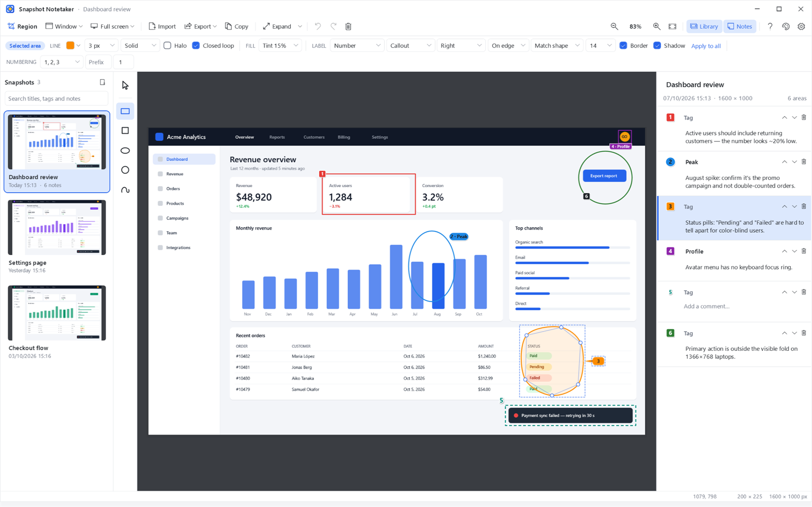
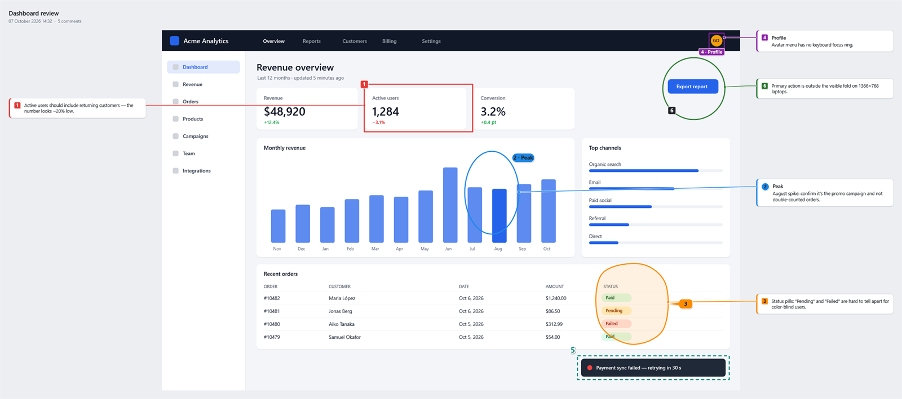

# Snapshot Notetaker

**Capture part of your screen, mark the areas that matter, number them and write a note for each, then hand the whole thing over as a single picture.**

A fast, native Windows app for bug reports, design reviews, QA, documentation and support tickets.



## Features

- **Capture anything:** drag a region, click a window, take one display or all of them. The picker freezes the screen and has a pixel magnifier. It works with high-DPI and mixed-DPI multi-monitor setups. You can also paste an image, drop a file or import one.
- **Mark areas** with rectangles, squares, ovals, circles and smooth splines. Draw splines freehand (they close themselves) or point by point. Everything stays editable: move, resize, add or remove points.
- **Number and tag** every area with a box, circle, corner tab, callout balloon or outlined text. Choose where each label sits and how it stays readable. *Adaptive* colours switch between dark and light depending on the screenshot underneath. Numbers update live as you add, remove or reorder areas.
- **Comment on each area** in the notes sidebar.
- **Hand it over in one go:** *Expand* shows the comments beside each area (or as a list), and *Copy* puts the screenshot, the marked areas and the comments on the clipboard as one image.
- **Never lose work:** every snapshot is saved automatically to a searchable library. Thumbnails show your edits, and you can reopen any snapshot to keep editing.
- **System-wide shortcuts** (PrintScreen by default, changeable in Settings) that work even when the app is in the notification area.
- **Themes:** Light, Dark, Midnight, Nord, Forest, Sepia, Rose, High contrast, or follow Windows.
- Lossless PNG export at the screen's native resolution. Also JPEG, BMP and a shareable `.snapnote` file that keeps everything editable.



## Download

1. Go to [**Releases**](../../releases/latest) and download `SnapshotNotetaker-<version>-win-x64.zip`. Use `win-arm64` for ARM-based PCs such as Surface Pro X or Snapdragon laptops.
2. Extract the zip anywhere, for example `C:\Tools\SnapshotNotetaker`.
3. Run `SnapshotNotetaker.exe`. There's no installer and you don't need .NET; everything is inside the exe.

**Requirements:** Windows 10 (version 1809 or later) or Windows 11, 64-bit.

> **"Windows protected your PC"?** The app isn't code-signed yet, so SmartScreen warns about it the first time. Click **More info → Run anyway**. You can check the download against `SHA256SUMS.txt` on the release page.
>
> The very first launch can take several seconds while Windows Defender scans the new file. Later launches are quick.

**Update:** replace the exe with the new one. Your snapshots and settings are kept.
**Uninstall:** delete the folder. To also remove your data, delete `%LOCALAPPDATA%\SnapshotNotetaker`.

## Quick start

1. Press **PrintScreen**, or click **Region**, and drag over what you want to capture. Click a window instead of dragging to capture just that window.
2. Draw areas with the tools on the left (`R` rectangle, `E` oval, `P` spline, `V` select). Each area gets a number.
3. Write a comment for each area in the **Notes** sidebar.
4. Turn on **Expand**, click **Copy**, and paste into your ticket, chat or email.

Closing the window keeps the app running in the notification area so your shortcuts keep working. To quit, right-click the tray icon and choose **Exit**.

<details>
<summary><b>Keyboard shortcuts</b></summary>

| Anywhere (while the app runs) | |
|---|---|
| `PrintScreen` | Capture a region (or click a window) |
| `Ctrl+PrintScreen` | Capture a window |
| `Shift+PrintScreen` | Capture the display under the mouse |
| `Ctrl+Shift+PrintScreen` | Capture all displays |

If another tool (Snagit, ShareX, Windows' own "PrintScreen opens Snipping Tool" setting…) already uses a key, Settings shows it, and you can pick another.

| In the editor | |
|---|---|
| `V` `R` `Q` `E` `C` `P` | Select, Rectangle, Square, Oval, Circle, Spline |
| `Shift` / `Alt` while drawing | Square or circle / draw from the center |
| `Del` | Delete the selected areas (or the selected spline point) |
| Arrows, `Shift`+arrows | Nudge 1 px / 10 px |
| `Ctrl+Z` / `Ctrl+Y` | Undo / redo |
| `Ctrl+D`, `Ctrl+A` | Duplicate, select all |
| `Ctrl`+wheel, `Ctrl+0`, `Ctrl+1` | Zoom, fit, 100 % |
| `Space`+drag, middle-drag | Pan |
| `Ctrl+Shift+E` | Expand on/off |
| `Ctrl+Shift+C`, `Ctrl+E` | Copy image, export image |
| `Ctrl+V` | Paste an image as a new snapshot |
| `Ctrl+L`, `Ctrl+B`, `Ctrl+F`, `F2` | Library, notes sidebar, search, rename |
</details>

## Your data and privacy

Everything stays on your PC. Snapshots live in `%LOCALAPPDATA%\SnapshotNotetaker\Snapshots` (you can choose another folder in Settings). Each one is a folder holding the original PNG and a plain JSON file with your notes.

The app makes no network connections, with one exception: builds that include crash reporting, and only after you agree. Even then, a report contains technical details only: never screenshots, notes, titles, your user name or your computer name. See [docs/PRIVACY.md](docs/PRIVACY.md).

## Getting help

Click the **?** button in the toolbar and choose **Help & support → Create support bundle**. It saves a zip with the app's logs and system details, plus the snapshot involved if you tick that box. Then [open an issue](../../issues/new/choose) and attach the zip.

## Building from source

You need Windows and the [.NET 10 SDK](https://dot.net).

```powershell
git clone <this repository>
cd snapshot-notetaker
dotnet test                                  # build and run the tests
dotnet run --project src/SnapshotNotetaker   # run the app
./scripts/publish.ps1                        # build the downloadable zip into ./artifacts
```

Architecture, diagnostics switches and the release process are described in [docs/DEVELOPMENT.md](docs/DEVELOPMENT.md).

## Contributing

Bug reports, ideas and pull requests are welcome; see [CONTRIBUTING.md](CONTRIBUTING.md). To report a security problem, see [SECURITY.md](SECURITY.md).

## License

[MIT](LICENSE) © 2026 Gerard Oliveras
